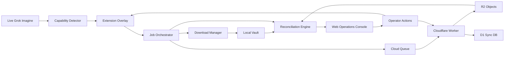
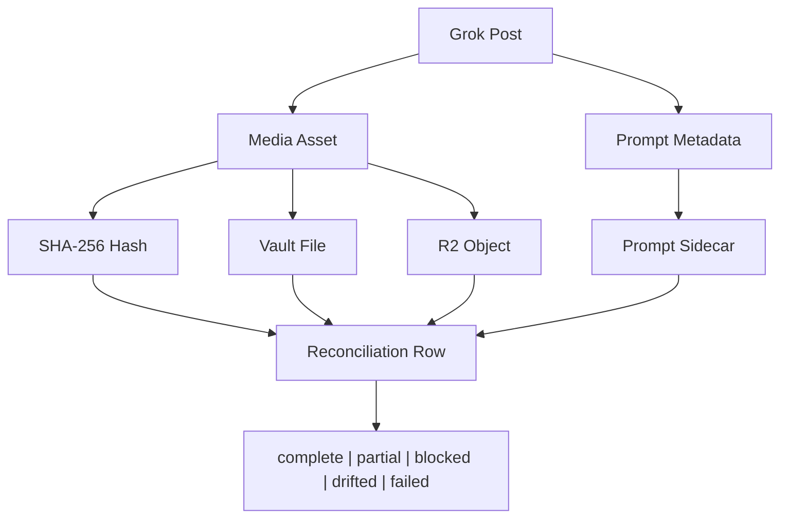

# Grok Power Tools Full System Reliability Rebuild Spec

Date: 2026-05-21
Status: Draft specification for the full build, not an MVP
Source audit: `docs/audits/2026-05-20-grok-powertools-full-system-audit/`

## 1. Executive Intent

The target is a fully reliable Grok Imagine operating system for generation, backup, reconciliation, recovery, and review. The product must not merely show that Grok can generate media or that a local Worker health endpoint responds. It must prove, for each important media item, where it came from, where it was downloaded, whether it is in the local Vault, whether it is in R2, whether its metadata is synced, and whether recovery actions can repair gaps.

This spec intentionally avoids an MVP reduction. The finished system must be production-grade for the local operator workflow:

- Grok UI drift is expected and handled.
- Extension state is observable without relying on the Chrome extension popup.
- Local Vault and R2 reconciliation is first-class data, not a manual audit afterthought.
- Every destructive or expensive automation path has preflight, stop, retry, and recovery behavior.
- The web app becomes the operations console for Vault/R2/Grok health in addition to its collection, editor, movie, and share surfaces.
- A single safe canary must prove the whole chain before bulk work is allowed.

## 2. Current Evidence Baseline

This spec is grounded in the 2026-05-20 audit plus a 2026-05-21 live Computer Use spot-check of `grok.com/imagine/saved`.

### 2.1 Confirmed Working

- Root unit tests passed during the audit: 4 suites, 112 tests.
- Cloud Worker typecheck passed.
- Web build passed.
- Local web app responded on `http://localhost:3001`.
- Local Worker responded on `http://localhost:8787/health`.
- Grok image canary creation worked.
- Grok image-to-video canary creation worked.
- Quality Repeat completed one repeat and produced four images on audit-owned safe content.
- Local Vault inventory completed: 1,853 files, 1,767,268,127 bytes, no zero-byte files.

### 2.2 Confirmed Broken Or Incomplete

- Root E2E failed because the Playwright Chrome API shim lacks `chrome.runtime.getURL`.
- Root lint failed because generated `cloud/.wrangler/tmp` files were included.
- Web lint failed with 9 errors and 24 warnings.
- Local `/api/auth/session` returned 500 due server auth configuration.
- Remote Satoshi font URL returned 404.
- Native Grok video Download created a file outside `GrokVault`.
- Canary media did not appear in `GrokVault`.
- R2 object-level evidence was unavailable.
- Prompted Batch failed `0/1` after `3/3` retries.
- Gallery Stop returned the overlay to idle but did not prevent an already-started post-detail navigation.
- Backfill, Retry Unsynced, live extension storage/config, and cloud test remained blocked because they are popup-only or popup-dependent.

### 2.3 Live Grok Spot-Check, 2026-05-21

Computer Use observed the current Chrome window at `grok.com/imagine/saved`. The page is a real Saved surface, with privacy-sensitive media and prompt content present. This spec records only UI/control facts:

- The page title and URL indicate `Imagine Saved - Grok` at `grok.com/imagine/saved`.
- Left navigation includes Home, Search, Imagine, Project, History, sidebar toggle, and profile controls.
- The main surface shows a `Saved` heading and a `New Project` action.
- A horizontal saved/prompt/project strip is visible above a media grid.
- View mode controls are visible for `Full` and `Compact`.
- Tag controls and `New Tag` are visible.
- The media grid exposes card-level `Select`, `More options`, and `Make video` controls.
- The bottom composer exposes `Upload`, text entry, disabled Submit when empty, Agent/Canvas affordance, Image/Video generation mode, Speed/Quality, and Aspect Ratio.
- The Grok Downloader extension has site access in Chrome, but the content overlay was not visible in this native spot-check. Live overlay state should therefore be verified explicitly during implementation runs.

Do not store raw prompt text, media captions, accessibility dumps, or screenshots from user content unless explicitly redacted or audit-owned.

## 3. Definition Of Perfect

The system is considered "running perfectly" only when all of these are true:

1. `npm run test:unit`, `npm run test:e2e`, root lint, `cd cloud && npm run typecheck`, `cd web && npm run lint`, and `cd web && npm run build` all pass.
2. Local web and Worker can be started from documented commands, with stable ports or clear fallback behavior.
3. A single audit-owned image canary can be generated in Grok and reconciled through:
   - Grok post identity
   - media asset URL and content hash
   - extension job record
   - local Vault file path
   - R2 object key
   - metadata sidecar
   - web dashboard reconciliation row
4. A single audit-owned video canary can pass the same chain.
5. Gallery scraping can start, pause, resume, stop, and abort without unexpected navigation continuing in the background.
6. Prompted Batch can complete a one-item safe run or fail with an exact, actionable reason.
7. Quality Repeat can complete, stop, and recover from a vanished `Generate More` control.
8. Backfill and Retry Unsynced are available through an approved, non-popup-only surface.
9. R2 status is proven by object-level verification, not inferred from Worker `/health`.
10. The web app exposes operational health and reconciliation state in addition to collection/editor/movie/share functions.
11. All dangerous counts and bulk actions require preflight confirmation.
12. Privacy-safe audit export can be produced without leaking user prompt text, media content, API keys, cookies, or bearer tokens.
13. R2 writes are idempotent: rerunning Saved/backfill/full-media backup must not create a second copy of the same old media or an unbounded daily copy of the same saved-list metadata.

## 4. Product Surface Map



## 5. Architecture Principles

### 5.1 Capability-Based Grok Automation

The extension must stop assuming one Grok URL or one selector is authoritative. It should model the live page as a set of observed capabilities:

- `canPromptText`
- `canSubmitPrompt`
- `canSwitchImageMode`
- `canSwitchVideoMode`
- `canChooseSpeed`
- `canChooseQuality`
- `canChooseAspectRatio`
- `canMakeVideoFromCard`
- `canMakeVideoFromDetail`
- `canGenerateMore`
- `canDownloadFromDetail`
- `canSelectCard`
- `canOpenMoreOptions`
- `canScrollSavedGrid`
- `canReadSavedTags`
- `canDetectGridCardIdentity`
- `canDetectPostDetailIdentity`
- `canDetectGenerationInProgress`
- `canDetectGenerationComplete`
- `canDetectModerationOrRateLimitBlock`

Each capability must include:

- Status: `available`, `unavailable`, `blocked`, `ambiguous`.
- Evidence: selector, text match, role match, DOM location, URL pattern, or visible-state marker.
- Confidence: `high`, `medium`, `low`.
- Last observed timestamp.
- Safe debug summary with prompt/media text redacted.

### 5.2 Reconciliation First

Every media item should have a durable identity graph. Success messages are not enough.



### 5.3 Observable Recovery

All recovery paths must be visible in the overlay and web app:

- Retry unsynced queue.
- Backfill metadata.
- Full media backup.
- Verify one canary.
- Verify one object key.
- Re-scan Vault.
- Re-scan current Grok page.
- Export redacted diagnostics.

No recovery control may exist only in the extension popup.

### 5.4 Privacy And Safety

The system interacts with live user Grok content. The default behavior must be privacy-preserving:

- Store hashes, IDs, filenames, and object keys by default.
- Store prompt text only when the operator has enabled prompt capture.
- Redact prompt text and media titles in audit exports by default.
- Never log cookies, API keys, bearer tokens, raw signed media URLs, or full accessibility dumps.
- Keep audit canaries harmless, explicit, and clearly named.

## 6. Data Model

### 6.1 Core Entities

#### `grok_post`

```ts
type GrokPost = {
  postId: string;
  sourceUrl: string;
  routeKind: "imagine" | "saved" | "post_detail" | "unknown";
  firstSeenAt: string;
  lastSeenAt: string;
  promptText?: string;
  promptCaptured: boolean;
  promptRedacted: boolean;
  tags: string[];
  currentCapabilities: string[];
};
```

#### `media_asset`

```ts
type MediaAsset = {
  assetId: string;
  postId?: string;
  sourceUrl: string;
  sourceUrlHash: string;
  canonicalIdentity:
    | { kind: "grok_post_media"; postId: string; mediaIndex: number; mediaType: "image" | "video" }
    | { kind: "source_url_hash"; sourceUrlHash: string; mediaType: "image" | "video" | "unknown" }
    | { kind: "content_hash"; sha256: string; mediaType: "image" | "video" | "unknown" };
  sourceHost: "imagine-public.x.ai" | "assets.grok.com" | "grok.com" | "unknown";
  mediaType: "image" | "video" | "unknown";
  width?: number;
  height?: number;
  durationSeconds?: number;
  contentType?: string;
  sha256?: string;
  observedAt: string;
  lastVerifiedAt?: string;
};
```

#### `vault_file`

```ts
type VaultFile = {
  vaultFileId: string;
  assetId?: string;
  absolutePath: string;
  relativePath: string;
  userId: string;
  dateFolder: string;
  filename: string;
  extension: string;
  sizeBytes: number;
  sha256: string;
  createdAt?: string;
  lastVerifiedAt: string;
};
```

#### `r2_object`

```ts
type R2Object = {
  objectKey: string;
  assetId?: string;
  canonicalKey: boolean;
  supersedesObjectKey?: string;
  duplicateOfObjectKey?: string;
  contentType: string;
  sizeBytes?: number;
  sha256?: string;
  etag?: string;
  uploadedAt?: string;
  lastHeadAt?: string;
  lastVerifiedAt?: string;
  verificationStatus: "verified" | "missing" | "blocked" | "stale";
};
```

#### `r2_dedupe_index`

```ts
type R2DedupeIndex = {
  userId: string;
  assetId: string;
  canonicalObjectKey: string;
  sourceUrlHashes: string[];
  contentSha256?: string;
  grokPostIds: string[];
  firstSeenAt: string;
  lastSeenAt: string;
  uploadStatus: "not_uploaded" | "uploaded" | "verified" | "blocked" | "failed";
  duplicateObjectKeys: string[];
};
```

#### `backup_job`

```ts
type BackupJob = {
  jobId: string;
  kind:
    | "single_canary"
    | "single_post"
    | "gallery_scan"
    | "prompted_batch"
    | "quality_repeat"
    | "metadata_backfill"
    | "full_media_backup";
  status:
    | "queued"
    | "running"
    | "paused"
    | "stopping"
    | "stopped"
    | "complete"
    | "partial"
    | "failed"
    | "blocked";
  sourceRoute: string;
  requestedCount?: number;
  completedCount: number;
  failedCount: number;
  blockedCount: number;
  startedAt?: string;
  finishedAt?: string;
  lastError?: BackupError;
  operatorInitiated: boolean;
};
```

#### `reconciliation_row`

```ts
type ReconciliationRow = {
  rowId: string;
  postId?: string;
  assetId?: string;
  mediaType: "image" | "video" | "unknown";
  grokSeen: boolean;
  extensionSeen: boolean;
  vaultSeen: boolean;
  r2Seen: boolean;
  metadataSeen: boolean;
  localSha256?: string;
  r2Sha256?: string;
  status: "complete" | "partial" | "blocked" | "failed" | "drifted";
  blockers: string[];
  nextAction?: string;
  updatedAt: string;
};
```

### 6.2 Error Model

All errors must be structured:

```ts
type BackupError = {
  code:
    | "GROK_SELECTOR_MISSING"
    | "GROK_ROUTE_DRIFT"
    | "GROK_RATE_LIMIT"
    | "GROK_MODERATION_BLOCK"
    | "DOWNLOAD_FAILED"
    | "VAULT_WRITE_FAILED"
    | "VAULT_FILE_MISSING"
    | "R2_PRESIGN_FAILED"
    | "R2_PUT_FAILED"
    | "R2_HEAD_FAILED"
    | "R2_LIST_BLOCKED"
    | "EXTENSION_CONTEXT_INVALIDATED"
    | "CHROME_POPUP_BLOCKED"
    | "AUTH_CONFIG_MISSING"
    | "BATCH_RETRY_EXHAUSTED"
    | "STOP_TIMEOUT";
  stage:
    | "detect"
    | "generate"
    | "download"
    | "hash"
    | "vault"
    | "presign"
    | "upload"
    | "verify"
    | "reconcile"
    | "ui";
  message: string;
  safeDetails?: Record<string, string | number | boolean | null>;
  retryable: boolean;
  occurredAt: string;
};
```

## 7. Extension Requirements

### 7.1 Capability Detector

Implement a dedicated detector module, separate from UI and job logic.

Required functions:

- `detectPageKind()`
- `detectComposerCapabilities()`
- `detectSavedGridCapabilities()`
- `detectPostDetailCapabilities()`
- `detectGenerationState()`
- `detectDownloadCapabilities()`
- `detectQualityRepeatCapabilities()`
- `detectBatchCapabilities()`
- `summarizeCapabilitiesForDiagnostics()`

The detector must support:

- `grok.com/imagine`
- `grok.com/imagine/saved`
- `grok.com/imagine/post/:id`
- Saved/project media grids
- Full and Compact view modes
- Card-level `Select`, `More options`, and `Make video`
- Composer-level Image/Video mode, Speed/Quality, and Aspect Ratio
- Detail-level Download, share, compose/post, and more-options surfaces

### 7.2 Overlay Redesign

The overlay must become an operator control panel, not a long stack of buttons.

Required layout:

- Persistent compact header:
  - Global status
  - Current page kind
  - Active job status
  - Unsynced count
  - Last error indicator
  - Minimize/dock control
- Tabs or segmented sections:
  - `Canary`
  - `Generate`
  - `Backup`
  - `Recover`
  - `Diagnostics`
  - `Settings`
- Compact mode:
  - Does not cover the composer submit button.
  - Can dock left, right, or bottom.
  - Shows only status, stop, and recovery indicators.
- Expanded mode:
  - Scrollable sections.
  - Critical backup and stop controls above generation niceties.
  - Resizable without losing persisted position.

Required controls:

- Run one image canary.
- Run one video canary.
- Verify current post to Vault and R2.
- Download current post to Vault.
- Start Gallery Download.
- Pause Gallery Download.
- Resume Gallery Download.
- Stop Gallery Download.
- Abort all in-flight work.
- Start Prompted Batch.
- Stop Prompted Batch.
- Start Quality Repeat.
- Stop Quality Repeat.
- Retry Unsynced.
- Run Metadata Backfill.
- Run Full Media Backup.
- Export Redacted Diagnostics.

### 7.3 Preflight And Safety

Any bulk or paid/expensive action must show a preflight summary:

- Route and page kind.
- Observed capabilities.
- Requested count.
- Effective limit.
- Estimated media type.
- Backup mode.
- Local Vault path.
- R2 key prefix.
- Whether R2 verification is available.
- Risk warnings:
  - high persisted counts
  - missing R2 config
  - popup-only fallback detected
  - unsafe selector confidence
  - Grok rate limit or moderation signal

The operator must explicitly confirm actions above one item or any full-media backup.

### 7.4 Download Manager

Download behavior must be extension-owned and reconciliation-aware.

Requirements:

- All extension backup downloads must route through the extension path, not native Grok naming.
- Default local path remains `GrokVault/{activeGrokUserId}/{yyyy-mm-dd}_Auto/{filename}.{ext}`.
- Path generation must be deterministic for the same asset when identity is available.
- If Grok native Download lands outside Vault, the system should classify it as a native download, not a backup success.
- Download completion must trigger:
  - file existence check
  - size check
  - SHA-256 hash
  - Vault record
  - optional R2 upload
  - reconciliation update
- Authenticated `assets.grok.com` downloads must use the existing offscreen file-read pattern, but with structured telemetry and verification.
- Public `imagine-public.x.ai` media may be fetched directly when host permission and CORS allow.
- Duplicate handling must distinguish:
  - same asset already complete
  - same filename different hash
  - same hash different source
  - skipped because operator chose no duplicates

### 7.5 Job Orchestrator

All long-running work must run through one orchestrator.

Required job features:

- Single active job lock by default.
- Explicit override for safe parallel read-only diagnostics.
- Durable job state in `chrome.storage.local`.
- Heartbeat timestamp.
- Current item identity.
- Pending async handles tracked.
- Stop token checked before every navigation, click, download, retry, and upload.
- Abort must cancel:
  - timers
  - mutation observers
  - pending navigation loops
  - queued downloads when possible
  - pending upload retries when possible
- Resume must be possible for gallery scans and queue uploads.
- Completion must emit a final structured result.

### 7.6 Gallery Scan

Requirements:

- Start from current `/imagine/saved` or compatible saved grid page.
- Count visible cards.
- Scroll and discover more cards.
- Track card identity by source URL, post ID, or stable DOM/image marker.
- Avoid reclicking processed cards.
- Respect Full/Compact view.
- Skip cards with low confidence, moderation block, missing media, or repeated failure.
- Stop must complete within a bounded timeout and prevent newly initiated post navigation.
- Pause must preserve queue and scroll state.
- Resume must continue from the durable queue.
- Output a job summary with scanned, downloaded, skipped, failed, and blocked counts.

### 7.7 Prompted Batch

Prompted Batch must be rebuilt around state transitions rather than fixed selectors.

Requirements:

- Supports gallery context and detail context.
- Supports current Grok composer controls:
  - Image/Video mode
  - Speed/Quality
  - Aspect Ratio
  - disabled Submit until prompt exists
- Supports image-to-video card action when no prompt text field appears.
- Success detection must account for:
  - progress indicator appears
  - new video result appears
  - post-detail URL changes
  - `Make video` returns
  - video element becomes ready
  - final media URL appears
- Failure detection must account for:
  - submit button missing
  - route changes unexpectedly
  - moderation/rate limit
  - generation timeout
  - retry exhaustion
- One-item safe run must be a required acceptance test.

### 7.8 Quality Repeat

Keep the working core, but harden it:

- Detect `Generate More` by text, role, visibility, and proximity to current generation surface.
- Inline quick buttons must not shift Grok layout or hide native controls.
- Overlay control must show:
  - target repeats
  - completed repeats
  - expected image count
  - last click time
  - current wait phase
- Stop must stop before next click.
- Timeout must be visible and retryable.
- Navigation away must produce `GROK_ROUTE_DRIFT`, not a generic stop.

### 7.9 Popup Role

The Chrome extension popup can remain as a configuration surface, but no critical audit or recovery path may require it.

Popup-only controls to promote into overlay and web:

- Test Upload Pipeline
- Retry Unsynced
- Run Backfill
- Full Media Backup
- Unsynced count
- Last Test result
- Last Error
- Backup mode
- Worker host
- Key prefix

Secrets must not be displayed in overlay or web. Show only redacted API key fingerprints, such as last 4 characters and a hash prefix.

## 8. Worker And R2 Requirements

### 8.1 Existing API To Preserve

Preserve:

- `GET /health`
- `POST /v1/presign`
- `POST /v1/metadata/snapshot`
- `POST /v1/sync/push`
- `GET /v1/sync/pull`

### 8.2 Add Object Verification API

Add endpoints that prove object-level state without exposing secrets:

#### `POST /v1/objects/verify`

Request:

```json
{
  "objectKey": "grok-powertools/v1/users/.../media/.../file.mp4",
  "expectedSha256": "optional",
  "expectedContentLength": 123,
  "expectedContentType": "video/mp4"
}
```

Response:

```json
{
  "ok": true,
  "exists": true,
  "objectKey": "...",
  "contentLength": 123,
  "contentType": "video/mp4",
  "etag": "...",
  "sha256Metadata": "...",
  "verifiedAt": "..."
}
```

#### `POST /v1/reconcile/canary`

Request:

```json
{
  "postId": "...",
  "assetId": "...",
  "localSha256": "...",
  "candidateObjectKeys": ["..."]
}
```

Response:

```json
{
  "ok": true,
  "status": "complete",
  "matches": [
    {
      "objectKey": "...",
      "exists": true,
      "sha256Matches": true
    }
  ],
  "blockers": []
}
```

#### `GET /v1/diagnostics/redacted`

Returns non-secret Worker configuration:

- service name
- key prefix
- bucket binding present
- bucket name configured
- account ID hash or suffix only
- D1 binding present
- build/version
- current timestamp
- allowed endpoint list

It must not return API keys, access keys, secrets, raw signed URLs, cookies, or bearer tokens.

### 8.3 R2 Object Metadata

Every uploaded media object must include metadata where possible:

- `x-amz-meta-grok-post-id`
- `x-amz-meta-asset-id`
- `x-amz-meta-source-host`
- `x-amz-meta-sha256`
- `x-amz-meta-captured-at`
- `x-amz-meta-extension-version`
- `x-amz-meta-job-id`

Sidecar prompt metadata must be separate and redactable:

- `{objectKey}.prompt.json`
- `{objectKey}.reconciliation.json`

### 8.4 R2 Deduplication, Idempotency, And Retention

R2 must be treated as an idempotent content store, not as a daily append-only dump of whatever the extension sees that day. The current codebase has enough date-based media-key behavior that the rebuild must explicitly prevent rerunning an old Saved scan from producing a second copy of the same already-backed-up media.

Requirements:

- No R2 media write may be keyed only by the current run date when the object represents an already-known Grok asset.
- Compute canonical asset identity before upload, using this priority:
  1. Grok post ID plus media index plus media type, when available.
  2. Stable media UUID parsed from the media URL or filename, when available.
  3. SHA-256 content hash after download or fetch.
  4. Source URL hash only as a temporary pending identity until a stronger identity is available.
- Canonical media objects should use:

```txt
grok-powertools/v1/users/{userId}/media/by-asset/{assetId}.{ext}
```

- If legacy date folders are preserved, the date folder must mean asset first-seen date, not the current backup run date.
- Date, Saved, and prompt-history views should be manifest or pointer objects, not duplicate media blobs:

```txt
grok-powertools/v1/users/{userId}/manifests/dates/{yyyy-mm-dd}.json
grok-powertools/v1/users/{userId}/manifests/saved/latest.json
```

- Before uploading a media blob, the extension or Worker must verify the canonical key with a `HEAD` request or verify endpoint:
  - If the object exists and size/hash match, skip upload and mark the job as `already_present`.
  - If the object exists but metadata is incomplete, update sidecar/index metadata only.
  - If the object exists and hash differs, write a conflict object under `conflicts/{assetId}/{timestamp}.{ext}` and surface an operator-visible conflict.
- Queue dedupe keys must be canonical asset IDs or canonical object keys, not raw source URLs or date-derived paths.
- The D1 or metadata index must enforce uniqueness:
  - unique `(user_id, asset_id)`
  - unique canonical object key
  - optional unique `(user_id, content_sha256, media_type)` for cross-post duplicate detection
  - unique `(user_id, kind, content_hash)` for versioned metadata snapshots if history is retained
- Full media backup must be resumable and idempotent:
  - Verified existing R2 objects are never uploaded again.
  - Matching local Vault files are reused by hash.
  - Daily scans of the same old Saved list update `lastSeenAt` and references, not duplicate blobs.

Metadata snapshot policy:

- `savedPrompts`, `promptHistory`, and `processedIds` continue to overwrite `*.latest.json`.
- Before writing metadata, compute stable canonical JSON and SHA-256. If unchanged from the latest hash, skip the write.
- `backfillManifest` must not create unbounded daily timestamped objects.
- Always write/update `backfill-manifest.latest.json`.
- Write versioned backfill history only when the canonical content hash changes.
- Default retention for versioned manifests is the last 30 changed manifests or 90 days, whichever keeps fewer objects, unless the operator opts into a longer policy.
- Saved-list exports follow the same pattern: `saved-list.latest.json`, with optional `saved-list.{hash}.json` history only on content change.

Required metrics:

- `r2BytesVerifiedExisting`
- `r2BytesUploadedNew`
- `r2DuplicateUploadsSkipped`
- `r2MetadataSnapshotsSkippedUnchanged`
- `r2ConflictsDetected`

Acceptance tests:

- Run the same Saved backup twice on the same day: the second run uploads 0 duplicate media bytes.
- Run the same Saved backup on a later day: it uploads 0 duplicate media bytes and creates no duplicate saved-list metadata when content is unchanged.
- Clear local `processedIds` and retry: R2 dedupe still prevents duplicate media objects.
- Observe the same media under two Grok cards: one canonical object is retained with two source references.
- Change the prompt list: latest metadata updates, and versioned history is written only when the canonical hash changes.

### 8.5 Cloud Auth

Keep extension-to-Worker media backup using `x-gpt-api-key` unless a stronger auth scheme is added. Web-to-Worker sync should continue using JWT with `WORKER_SYNC_SECRET`, but local unauthenticated smoke should not 500 when auth env vars are absent.

Required local behavior:

- `/api/auth/session` returns a valid unauthenticated session response, not 500.
- Missing sync env vars disable sync with a visible status, not a crash.
- Worker diagnostics clearly show "sync not configured" versus "R2 not configured".

## 9. Web App Requirements

### 9.1 Keep Existing Product Surfaces

The following must remain supported:

- Dashboard
- Collections
- Collection detail
- Editor
- Movie/storyboard
- Share
- Prompt library
- Settings
- Auth and sync

### 9.2 Add Operations Console

Add a first-class route, recommended path: `/ops`.

Sections:

1. **System Health**
   - Extension version
   - Last extension heartbeat
   - Worker health
   - Worker redacted diagnostics
   - R2 verification availability
   - Web auth/sync status
   - Local browser IndexedDB status

2. **Backup Pipeline**
   - Current backup mode
   - Local Vault path
   - Worker host
   - Key prefix
   - Unsynced queue count
   - Processing state
   - Last successful upload
   - Last failed upload
   - Retry schedule

3. **Reconciliation**
   - Rows by status: complete, partial, blocked, failed, drifted
   - Filters by media type, source host, date folder, job, tag
   - Row detail drawer with Grok post, Vault path, R2 key, hashes, blockers
   - "Verify selected"
   - "Repair selected"
   - "Export redacted report"

4. **Canary Lab**
   - Run image canary
   - Run video canary
   - Verify current canary
   - Show all chain steps
   - Block bulk backup until one canary has passed in current config

5. **Recovery**
   - Retry unsynced
   - Run metadata backfill
   - Run full media backup
   - Re-scan Vault
   - Re-scan current Grok page
   - Clear resolved errors

6. **Grok Drift**
   - Latest observed page kind
   - Latest capability snapshot
   - Selector confidence
   - Route drift warnings
   - Known missing controls

### 9.3 Web Data Ingestion

The web app needs a safe bridge from extension diagnostics to the app.

Preferred options:

1. Extension writes redacted diagnostics to `chrome.storage.local`, and the overlay exports a JSON file for web import.
2. Extension exposes a local diagnostic export download that the web app can import.
3. Future optional native companion or local API can provide direct Vault scanning, but this should not be assumed for browser-only V1.

The web app cannot directly read arbitrary local `GrokVault` files without user selection or a companion process. The spec must not pretend otherwise.

### 9.4 Web UX Standard

This is an operations surface. It should be dense, clear, and status-driven:

- No marketing hero.
- No decorative cards for core status.
- Tables must support sorting, filtering, and detail drawers.
- Status language must distinguish `verified`, `blocked`, `failed`, and `unproven`.
- Dangerous actions require confirmation with exact counts.
- Empty states must say what evidence is missing and how to collect it.

## 10. Local Vault Requirements

### 10.1 Inventory

The inventory script from the audit should become a reusable product diagnostic command.

Required output:

- total files
- total bytes
- by extension
- by date folder
- zero-byte files
- duplicate filenames
- duplicate hashes
- optional file-level CSV
- optional redacted JSON summary

### 10.2 Hashing And Sidecars

Every extension-owned download should produce:

- media file
- computed SHA-256
- sidecar JSON or durable extension record with:
  - post ID
  - source URL host
  - source URL redacted when needed
  - media type
  - dimensions/duration if available
  - prompt capture state
  - R2 object key if uploaded
  - job ID
  - capture timestamp

### 10.3 Migration

Existing Vault files should be importable into the reconciliation model:

- infer date folder
- infer filename and extension
- compute hash
- optionally match against known Grok post IDs or prompt exports
- mark unmatched files as `vault_only`
- never delete or move existing files during import unless the operator confirms a separate cleanup action

## 11. Testing And Verification

### 11.1 Automated Gates

All must pass before calling the system fixed:

```bash
npm run test:unit
npm run test:e2e
npm run lint
cd cloud && npm run typecheck
cd web && npm run lint
cd web && npm run build
```

Add targeted tests for:

- `chrome.runtime.getURL` E2E shim.
- Capability detector against saved fixture pages.
- Capability detector against post-detail fixture pages.
- Stop token cancellation.
- Prompted Batch one-item success and failure states.
- Quality Repeat stop and timeout.
- Download path generation.
- R2 object key generation.
- R2 verify endpoint.
- Redacted diagnostics.
- Web `/ops` status rendering.
- Auth session local unauthenticated behavior.

### 11.2 Fixture Strategy

Create sanitized Grok DOM fixtures:

- saved grid full view
- saved grid compact view
- post detail image
- post detail video
- composer empty
- composer with prompt
- generation in progress
- Generate More available
- moderation/rate-limit block
- missing download
- More options menu open

Fixtures must not include real user prompt text or real sensitive media.

### 11.3 Live Test Protocol

Live tests must use audit-owned safe canaries only.

Required sequence:

1. Capture baseline status.
2. Verify Worker diagnostics.
3. Verify R2 object verification path.
4. Verify extension cloud config redacted status.
5. Run one image canary.
6. Download through extension to Vault.
7. Verify hash and sidecar.
8. Upload to R2.
9. Verify R2 object.
10. Show web reconciliation complete.
11. Run one video canary through the same chain.
12. Run one-item Prompted Batch.
13. Run one Quality Repeat.
14. Start and stop Gallery Download with no lingering navigation.
15. Export redacted audit.

### 11.4 Computer Use Protocol

When live Grok behavior must be checked:

- Prefer browser automation when available.
- Use Computer Use for the user-profile Chrome session when browser automation cannot reach it.
- Do not copy raw prompt text or media labels from accessibility output into docs.
- Save only redacted screenshots or audit-owned canary screenshots.
- Record control-level facts: visible controls, disabled/enabled state, route, page kind, capability availability.

## 12. Implementation Tracks

These are not MVP phases. They are dependency-ordered tracks for the complete build.

### Track A: Clean Baseline

Deliverables:

- Root E2E shim fixed with `chrome.runtime.getURL`.
- Root lint excludes generated `cloud/.wrangler/tmp` or cleans it before lint.
- Web lint errors fixed.
- Auth local unauthenticated session no longer 500s.
- Font dependency self-hosted or replaced.
- Documented run commands.

Acceptance:

- All automated gates pass.
- Visual web smoke has no console 500s for unauthenticated baseline.

### Track B: Capability Detector And Fixtures

Deliverables:

- Dedicated detector module.
- Sanitized fixtures.
- Unit tests for each page kind and capability.
- Diagnostic summary with redaction.

Acceptance:

- Detector recognizes current `grok.com/imagine/saved` control model.
- Detector does not depend only on `/saved` URL.

### Track C: Job Orchestrator And Overlay Redesign

Deliverables:

- Durable job state.
- Stop/pause/resume/abort tokens.
- Operator overlay redesign.
- Preflight confirmations.
- Popup-only critical controls promoted.

Acceptance:

- Stop cancels pending work within bounded timeout.
- Overlay no longer blocks composer in default/compact mode.
- Backfill and Retry Unsynced can be triggered without opening popup.

### Track D: Download, Vault, And Reconciliation

Deliverables:

- Extension-owned current post download.
- Hashing and sidecar metadata.
- Vault inventory integrated as reusable command.
- Reconciliation rows in extension state and web-import format.

Acceptance:

- One image and one video canary land under `GrokVault`.
- Reconciliation distinguishes native-download-outside-Vault from successful backup.

### Track E: Worker/R2 Verification

Deliverables:

- Object verify endpoint.
- Redacted diagnostics endpoint.
- Canary reconcile endpoint.
- R2 object metadata and sidecars.
- Canonical media object keys and R2 dedupe index.
- Verify-before-PUT path for existing canonical objects.
- Metadata snapshot hashing, unchanged-write skipping, and retention policy.
- Better Cloudflare account/config error reporting.

Acceptance:

- One canary object can be proven by R2 key and metadata.
- Worker `/health` is no longer treated as backup proof.
- Rerunning the same Saved backup uploads 0 duplicate media bytes.
- Unchanged saved-list and backfill metadata does not create daily duplicate objects.

### Track F: Web Operations Console

Deliverables:

- `/ops` route.
- System Health panel.
- Backup Pipeline panel.
- Reconciliation table and detail drawer.
- Canary Lab.
- Recovery actions.
- Drift panel.

Acceptance:

- Operator can see exactly which chain step is blocked.
- Redacted diagnostics import/export works.
- Complete canary chain is visible in web.

### Track G: Live Flow Hardening

Deliverables:

- Prompted Batch rebuild.
- Quality Repeat hardening.
- Gallery scan pause/resume/stop.
- Full media backup preflight and resumability.

Acceptance:

- One-item Prompted Batch passes.
- Quality Repeat stop and success paths pass.
- Gallery Stop leaves no new navigation or pending click loop.

### Track H: Final End-To-End Reliability Exercise

Deliverables:

- Full live exercise with safe canaries.
- Redacted evidence bundle.
- Updated visual one-pager.
- Updated operator runbook.

Acceptance:

- Every Definition Of Perfect item is either verified green or blocked by a user-owned external dependency explicitly listed with exact remediation.

## 13. Security And Privacy Requirements

- API keys stored only in extension storage or Worker secrets.
- API keys never sent to web UI except redacted fingerprint.
- Worker diagnostics never return secrets.
- R2 signed URLs never logged in full.
- Prompt text capture is configurable.
- Redacted audit export is default.
- Full prompt/media export requires explicit operator confirmation.
- Extension must never broad-delete local Vault files or R2 objects as part of reconciliation.
- Any future delete/cleanup feature must be separate, dry-run first, and require exact confirmation.

## 14. Observability Requirements

### 14.1 Extension Logs

Structured event types:

- `capability.detected`
- `job.started`
- `job.progress`
- `job.paused`
- `job.stopping`
- `job.stopped`
- `job.completed`
- `job.failed`
- `download.started`
- `download.completed`
- `vault.verified`
- `r2.presign.started`
- `r2.upload.completed`
- `r2.verify.completed`
- `reconcile.updated`
- `diagnostic.exported`

Each event must include:

- timestamp
- job ID when applicable
- safe stage
- safe status
- redacted identifiers
- error code when applicable

### 14.2 Web Console

The web app should show:

- last event time
- event source
- event severity
- retryability
- next action
- link to related reconciliation row

## 15. Configuration Requirements

### 15.1 Extension Config

- download root
- active Grok user ID
- backup mode: local only, cloud only, dual write
- Worker URL
- API key
- key prefix
- prompt capture mode
- privacy mode
- default batch count
- default gallery limit
- max retry count
- generation timeout
- stop timeout

### 15.2 Worker Config

- R2 account ID
- R2 bucket name
- R2 signing credentials
- key prefix
- client API key
- sync secret
- D1 binding
- optional build/version

### 15.3 Web Config

- Auth provider config
- local unauthenticated mode behavior
- Worker URL
- Worker sync secret
- feature flags for `/ops`
- diagnostic import limits

## 16. R2 And Cloudflare Account Remediation

The audit found account/auth mismatch:

- account `e8d3925cac56cc5a4927c16024531994` returned R2 disabled code `10042`
- accounts `ae55f67eccbee0bca65247faea6d5024` and `ba5339fd86e87c226bdc306347636042` returned auth error code `10000`
- `cloud/wrangler.toml` points at account `ba5339fd86e87c226bdc306347636042`

Current implementation status: the user-confirmed Greymaker Cloudflare account is authoritative for `grok-gallery-001`. The exact login email is intentionally omitted from this repo artifact. The implementation pass switched Wrangler OAuth to account `ba5339fd86e87c226bdc306347636042`, verified bucket `grok-gallery-001`, verified D1 database `grok-powertools-db`, deployed the Worker, and wrote/read a prefixed `_system` R2 smoke object. Authenticated extension endpoint proof still requires the extension-configured API key value or a user-approved secret rotation.

Required remediation:

1. Verify the active Chrome Cloudflare session maps to the authoritative Greymaker account for `grok-gallery-001`.
2. Refresh or switch Wrangler OAuth to that account if CLI state does not match Chrome/account reality.
3. Verify `wrangler r2 bucket list` against the exact account.
4. Verify Worker deploy target.
5. Verify Worker secrets exist.
6. Run `Test Upload Pipeline`.
7. Verify `_system/upload-test.txt` or equivalent object with object-level evidence.
8. Only then allow full media backup.

## 17. Acceptance Matrix

| Area | Required Proof | Passing State |
| --- | --- | --- |
| Tests | CLI output | All gates exit 0 |
| Grok detector | fixture and live control facts | Current controls mapped with high/medium confidence |
| Overlay | browser visual proof | Does not cover composer; recovery controls accessible |
| Image canary | reconciliation row | Grok, extension, Vault, R2, metadata complete |
| Video canary | reconciliation row | Grok, extension, Vault, R2, metadata complete |
| Vault | inventory + hash | File exists, size > 0, hash recorded |
| R2 | verify endpoint | Object exists with expected key and metadata |
| R2 dedupe | repeat backup proof | Same Saved set run twice uploads 0 duplicate media bytes and creates no unchanged daily saved-list snapshot |
| Prompted Batch | live one-item run | Complete or precise structured failure |
| Quality Repeat | live safe run | Completes and stop works |
| Gallery Stop | live controlled run | No post-stop navigation/click/download starts |
| Backfill | visible recovery action | Metadata snapshot object verified |
| Retry Unsynced | visible recovery action | Queue decreases or exact blocker shown |
| Web ops | browser smoke | `/ops` shows health, backup, reconciliation, canary, recovery |
| Privacy export | artifact scan | No secrets, cookies, raw signed URLs, or unrelated prompt/media text |

## 18. Open Decisions

1. Should the web app be the primary operations console, or should the overlay remain primary with the web app as a read-only mirror?
2. Should a native/local companion process be added for direct Vault scanning from the web app, or should imports remain file/export based?
3. Should prompt text be captured by default, redacted by default, or opt-in per job?
4. Should R2 custom domains be supported, or should V1 continue to require `workers.dev` Worker URLs?
5. Should full media backup include existing local Vault media upload, or only future extension-owned downloads plus metadata backfill?
6. What is the canonical `activeGrokUserId` when the Grok UI does not expose a stable account identifier?
7. Should existing duplicate Vault files be normalized later, or only reported?
8. What is the maximum safe default for batch and gallery limits?
9. Should legacy date-folder R2 media objects remain as alias/manifests only, or should existing objects be migrated into canonical by-asset keys over time?
10. Should the versioned metadata/backfill retention window stay at the proposed last 30 changed manifests or 90 days cap, or does the operator need a longer audit-history policy?

## 19. First Build Recommendation

Start with the dependency spine, not UI polish:

1. Clean baseline gates.
2. Capability detector with fixtures.
3. Redacted diagnostics available from overlay and web import.
4. Extension-owned canary download to Vault.
5. Worker object verification.
6. Web `/ops` canary reconciliation.

This is still part of the full spec, not an MVP. It is the smallest sequence that creates trustworthy proof for every later change.
